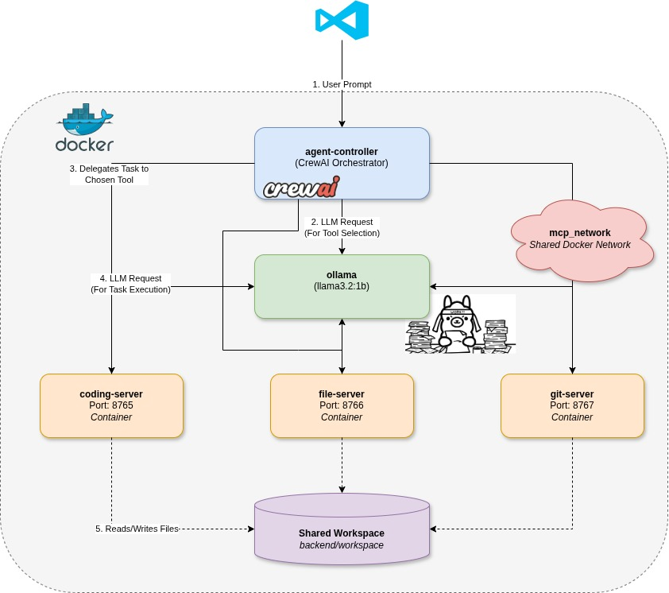

# VSCODE Extension for Coding support


---
This is the README for VSCODE Extension for Coder support. This tool utilized:
- MCP Server - Client for agents
- Ollama to run LLMs locally
- CrewAI and Langchain to run agents orchestration

## Features

This tool wil support you to:
- Explain the piece of code.
- Write unit test for a function
- Fix error in the code.
- Create a boilerplate code.
- Write git commit, git command, etc
- Auto deploy with docker compose, run unit test and send notification (Developing)
## Requirements

- Python 3.10++ for backend.

- Nodejs for npm, npx.

- uv 

## Project structure
```
MCP-Server
├── backend/                            # Backend
│   ├── coding_agent/                             
│   │   ├── coding_client.py             
│   │   ├── coding_server.py  
│   │   ├── run.sh 
│   ├── file_agent/                             
│   │   ├── file__client.py              
│   │   ├── file__server.py  
│   │   ├── run.sh 
│   ├── coding_agent/                             
│   │   ├── git_client.py              
│   │   ├── git_server.py  
│   │   ├── run.sh 
│   ├── agent_controller.py             # Multi agents orchestration
│   ├── docker-compose.yml
│   ├── Dockerfile
│   ├── tools.py
│   ├── requirements.txt
│   ├── pyproject.toml
│   ├── run_controller.sh               # Collaborate three agents 
├── src/                                # Ui for vscode view and webview
│   ├── tests/                          
|   |   ├── extension.test.ts   
│   ├── webview/     
|   |   ├── api.ts
|   |   ├── index.html
|   |   ├── style.css
|   |   ├── main.js  
│   ├── extension.ts   
├── workspace/                          # Empty directory                     
├── package.json 
├── .vscode-test.mjs
├── esbuild.config.mjs
├── esbuild.js                          # In ESModule format
├── run_all.sh
├── tsconfig.json
├── .gitignore
├── .vscodeignore
├── README.md
            
```
## Usage

- Setup uv:

```bash
curl -LsSf https://astral.sh/uv/install.sh | sh
uv init <project name>
```
- Navigate to new folder, then run these commands:

```bash
npm install -g yo generator-code
yo code
```

- Choose following these configs:

```bash
What type of extension do you want to create?
>> New Extension (TypeScript)

What's the name of your extension? 
>> mcp-server

What's the identifier of your extension?
>> mcp-server

What's the description of your extension? 
>> You can skip this.

Initialize a git repository? 
>> Yes or No, your choice.

Bundle the source code with webpack:
>> esbuild

Which package manager to use?
>> npm 
```

- Then clone this repo

```bash
cd ..
git clone <repo-url>
cd mcp-server   # This is neccessary to run both service and extension
chmod +x run_all.sh
./run_all.sh
```

## Integrate in VSCode

After run <./run_all.sh>, go to VSCode
 >> Click "Run and Debug" (or press "Ctrl + Shift + D").

 >> Click :arrow_forward: to run extension (VSCode will open a new window which is the Client).
 
 >> In the Client window, open Command Pallet (or press "Ctrl + Shift + P") to type command.


## Commands can be used in Command Pallet

```bash
Start MCP Agent Session
```

## Issues

Please contact or open an issue for error founded.


---

**Enjoy!**
